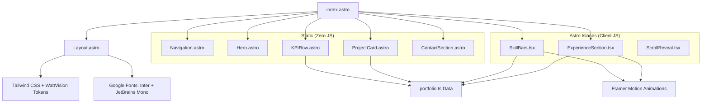
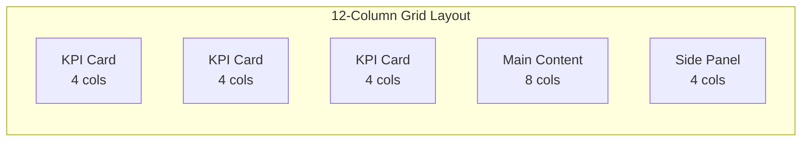
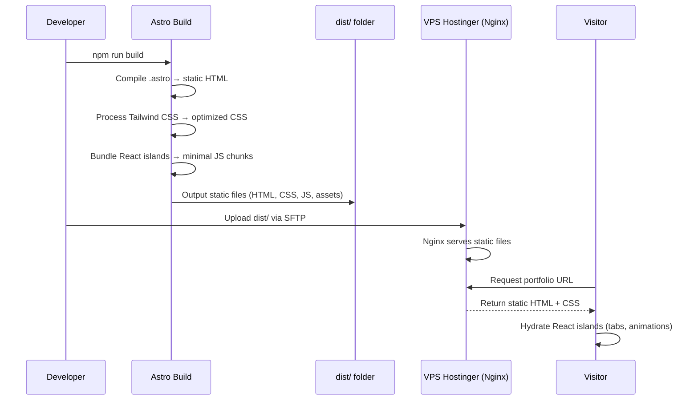
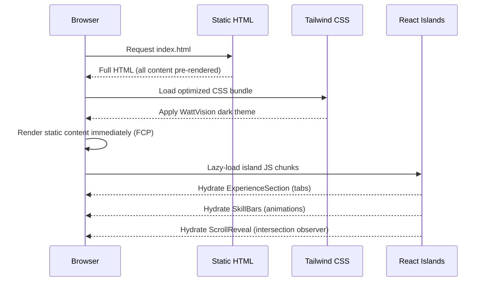

# Design Document: WattVision Portfolio

## Overview

A static portfolio website for **Bintang Maulana Magribi** (Geodesy & Geomatics Engineer) that presents professional experience, projects, and skills using the WattVision design system aesthetic — a dark-mode, data-driven dashboard interface that feels like a simplified Power BI dashboard for personal data.

The site transforms traditional portfolio content into "metrics" and "data visualizations," presenting them through KPI cards, animated skill bars, and timeline-style panels.

## Tech Stack

| Layer | Technology | Version | Alasan |
|-------|-----------|---------|--------|
| **Framework** | Astro | 5.x | Static site generator, zero JS by default, sangat ringan |
| **UI Islands** | React | 18.x | Untuk komponen interaktif (tabs, animations) via Astro Islands |
| **Styling** | Tailwind CSS | 4.x | Utility-first, mudah custom dark theme WattVision |
| **Animation** | Framer Motion | 11.x | Smooth page transitions, scroll animations, stagger effects |
| **Font** | Inter + JetBrains Mono | - | Google Fonts, sesuai DESIGN.md |
| **Icons** | Lucide React | - | Modern, lightweight icon set |
| **Build** | Astro Build (Vite) | - | Fast builds, output static HTML |
| **Deploy** | VPS Hostinger | - | Static files via Nginx/Apache |

### Mengapa Astro?
- Output static HTML murni — sangat ringan untuk portfolio
- "Islands Architecture" — hanya komponen interaktif yang load JS
- Tailwind CSS terintegrasi out-of-the-box
- Build output bisa langsung upload ke VPS tanpa server-side runtime
- Perfect performance score di Lighthouse

### Deploy Strategy (VPS Hostinger)
- Build locally: `npm run build` → output ke `dist/`
- Upload folder `dist/` ke VPS via SFTP/SCP
- Serve via Nginx sebagai static files
- Optional: setup GitHub Actions untuk auto-deploy on push

## Architecture

### Project Structure

```
portfolio/
├── src/
│   ├── layouts/
│   │   └── Layout.astro              # Base HTML layout with fonts & meta
│   ├── pages/
│   │   └── index.astro               # Single page (all sections)
│   ├── components/
│   │   ├── Navigation.astro          # Top nav (static, no JS needed)
│   │   ├── Hero.astro                # Hero section with tagline
│   │   ├── KPIRow.astro              # 3 KPI metric cards
│   │   ├── KPICard.astro             # Single KPI card
│   │   ├── Specializations.astro     # 4 specialization cards
│   │   ├── ExperienceSection.tsx     # React island (tabs + animation)
│   │   ├── ExperienceCard.tsx        # Single experience card (animated)
│   │   ├── ProjectCard.astro         # Project card
│   │   ├── SkillBars.tsx             # React island (animated bars)
│   │   ├── OrganizationGrid.astro    # Organization experience
│   │   ├── ContactSection.astro      # Contact info cards
│   │   └── ScrollReveal.tsx          # React island (scroll animation wrapper)
│   ├── data/
│   │   └── portfolio.ts              # Typed portfolio data (no JSON fetch needed)
│   ├── styles/
│   │   └── global.css                # Tailwind directives + custom WattVision tokens
│   └── types/
│       └── portfolio.ts              # TypeScript interfaces
├── public/
│   ├── assets/
│   │   └── img/                      # Profile photo, project screenshots
│   └── favicon.svg
├── astro.config.mjs
├── tailwind.config.mjs
├── tsconfig.json
└── package.json
```

### Architecture Diagram



### Layout Grid (12 Column)



## Sequence Diagrams

### Build & Deploy Flow



### Page Load Flow (Visitor)



## Components and Interfaces

### Component 1: KPI Card

**Purpose**: Displays a single key metric (e.g., years of experience, projects completed, technologies used) in the WattVision monospace-metric style.

**Interface**:
```javascript
/**
 * @typedef {Object} KPIConfig
 * @property {string} label - Metric label (e.g., "Projects Shipped")
 * @property {string|number} value - Primary metric value
 * @property {string} [unit] - Optional unit suffix (e.g., "+", "yrs")
 * @property {'primary'|'alert'|'success'} [accent] - Color accent type
 * @property {string} [icon] - Icon identifier (bolt, plug, meter)
 * @property {string} [trend] - Trend indicator (e.g., "+3 this year")
 */

/**
 * Creates a KPI card DOM element
 * @param {KPIConfig} config
 * @returns {HTMLElement}
 */
function createKPICard(config) {}
```

**Responsibilities**:
- Render metric value in JetBrains Mono/Fira Code at 32px bold
- Apply correct accent color based on type
- Display label in Inter 14px secondary text color
- Maintain 16px border-radius card styling with #1E1E1E background

### Component 2: Project Card

**Purpose**: Displays a project showcase with title, description, tech stack tags, and links.

**Interface**:
```javascript
/**
 * @typedef {Object} Project
 * @property {string} id - Unique project identifier
 * @property {string} title - Project name
 * @property {string} description - Brief project description
 * @property {string[]} techStack - List of technologies used
 * @property {string} [liveUrl] - Live demo link
 * @property {string} [repoUrl] - Repository link
 * @property {string} [imageUrl] - Screenshot/thumbnail path
 * @property {'active'|'completed'|'archived'} status - Project status
 * @property {string} year - Year completed
 */

/**
 * Creates a project card DOM element
 * @param {Project} project
 * @returns {HTMLElement}
 */
function createProjectCard(project) {}
```

**Responsibilities**:
- Render project info within a WattVision card (16px radius, #1E1E1E bg, subtle border)
- Display status indicator using green (#32D74B) for active, cyan (#00E5FF) for completed
- Show tech stack as small tag elements with cyan border
- Include hover state transitioning background to #252525

### Component 3: Skill Chart

**Purpose**: Renders skills as area/bar charts mimicking the WattVision data visualization style.

**Interface**:
```javascript
/**
 * @typedef {Object} Skill
 * @property {string} name - Skill name
 * @property {number} level - Proficiency 0-100
 * @property {string} category - Skill category (frontend, backend, tools, etc.)
 * @property {number} yearsUsed - Years of experience with this skill
 */

/**
 * Renders a skill visualization into a container
 * @param {HTMLElement} container - Target container element
 * @param {Skill[]} skills - Array of skills to visualize
 * @param {'bar'|'area'|'radar'} [type='bar'] - Visualization type
 */
function renderSkillChart(container, skills, type) {}
```

**Responsibilities**:
- Draw skill levels using CSS/SVG with #00E5FF primary data color
- Use #2C2C2E for grid lines
- Apply gradient from #00E5FF to #30D158 for area fills
- Render axis labels in Inter 14px, values in JetBrains Mono

### Component 4: Alert/Experience Panel

**Purpose**: Displays experience timeline entries in the WattVision alert panel style.

**Interface**:
```javascript
/**
 * @typedef {Object} Experience
 * @property {string} role - Job title
 * @property {string} company - Company name
 * @property {string} startDate - Start date (YYYY-MM)
 * @property {string} [endDate] - End date or null for current
 * @property {string[]} highlights - Key achievements
 * @property {'current'|'past'} status
 */

/**
 * Creates an experience timeline panel
 * @param {Experience[]} experiences
 * @returns {HTMLElement}
 */
function createExperiencePanel(experiences) {}
```

**Responsibilities**:
- Render current role with green (#32D74B) left border (4px solid)
- Render past roles with subtle #2C2C2E left border
- Use the alert-box pattern: colored left border, darker background (#3A1C1C style but using appropriate colors)
- Display dates in monospace font

### Component 5: Navigation

**Purpose**: Top navigation bar with section links and optional theme indicator.

**Interface**:
```javascript
/**
 * @typedef {Object} NavConfig
 * @property {Array<{id: string, label: string, icon?: string}>} sections
 * @property {string} brandName - Portfolio owner name
 */

/**
 * Creates the navigation bar
 * @param {NavConfig} config
 * @returns {HTMLElement}
 */
function createNavigation(config) {}
```

**Responsibilities**:
- Fixed positioning at top
- Background #121212 with bottom border #2C2C2E
- Active section indicator using #00E5FF underline
- Smooth scroll or hash-based navigation

## Data Models

### Portfolio Data Schema

```javascript
/**
 * @typedef {Object} PortfolioData
 * @property {PersonalInfo} personal
 * @property {Stat[]} stats - KPI metrics to display
 * @property {Project[]} projects
 * @property {Skill[]} skills
 * @property {Experience[]} experience
 * @property {ContactInfo} contact
 */

/**
 * @typedef {Object} PersonalInfo
 * @property {string} name - Full name
 * @property {string} title - Professional title
 * @property {string} tagline - Short bio/tagline
 * @property {string} [avatarUrl] - Profile image path
 */

/**
 * @typedef {Object} Stat
 * @property {string} label - Metric name
 * @property {string|number} value - Metric value
 * @property {string} [unit] - Unit suffix
 * @property {'primary'|'alert'|'success'} accent - Color type
 * @property {string} [icon] - Icon identifier
 */

/**
 * @typedef {Object} ContactInfo
 * @property {string} [email]
 * @property {string} [github]
 * @property {string} [linkedin]
 * @property {string} [website]
 */
```

**Validation Rules**:
- `stats` array must contain exactly 3 items (for 3-column KPI layout)
- `skills[].level` must be between 0 and 100
- `experience` array must be sorted by startDate descending
- `projects[].techStack` must have at least 1 item
- All URLs must be valid (start with http:// or https://)

### CSS Token Schema (Custom Properties)

```css
:root {
  /* WattVision Color Tokens */
  --wv-bg-primary: #121212;
  --wv-bg-surface: #1E1E1E;
  --wv-bg-hover: #252525;
  --wv-border: #2C2C2E;
  
  --wv-accent-primary: #00E5FF;
  --wv-accent-alert: #FF453A;
  --wv-accent-success: #32D74B;
  --wv-gradient-start: #00E5FF;
  --wv-gradient-end: #30D158;
  
  --wv-text-primary: #FFFFFF;
  --wv-text-secondary: #98989D;
  
  /* Typography Tokens */
  --wv-font-title: 'Inter', sans-serif;
  --wv-font-mono: 'JetBrains Mono', 'Fira Code', monospace;
  --wv-font-body: 'Inter', sans-serif;
  
  --wv-size-title: 24px;
  --wv-size-metric: 32px;
  --wv-size-body: 14px;
  --wv-weight-title: 600;
  --wv-weight-metric: 700;
  
  /* Layout Tokens */
  --wv-radius: 16px;
  --wv-padding-card: 20px;
  --wv-grid-columns: 12;
  --wv-spacing-unit: 8px;
  
  /* Alert Panel Tokens */
  --wv-alert-bg: #3A1C1C;
  --wv-alert-border-width: 4px;
}
```

## Algorithmic Pseudocode

### Main Application Bootstrap

```javascript
// ALGORITHM: Application Initialization
// INPUT: None (reads from DOM and network)
// OUTPUT: Fully rendered portfolio page

async function initializeApp() {
  // PRECONDITION: DOM is loaded, portfolio.json exists at known path
  
  // Step 1: Load portfolio data
  const data = await loadPortfolioData('./data/portfolio.json');
  // ASSERT: data !== null && data.personal !== undefined
  
  // Step 2: Render navigation
  const nav = createNavigation({
    sections: [
      { id: 'overview', label: 'Overview' },
      { id: 'projects', label: 'Projects' },
      { id: 'skills', label: 'Skills' },
      { id: 'experience', label: 'Experience' },
      { id: 'contact', label: 'Contact' }
    ],
    brandName: data.personal.name
  });
  document.getElementById('nav-container').appendChild(nav);
  
  // Step 3: Render KPI row (3 cards, 4 cols each)
  const kpiRow = document.getElementById('kpi-row');
  for (const stat of data.stats) {
    // INVARIANT: each stat produces exactly one KPI card spanning 4 columns
    kpiRow.appendChild(createKPICard(stat));
  }
  
  // Step 4: Render main content sections
  renderProjects(data.projects);
  renderSkillChart(
    document.getElementById('skills-chart'),
    data.skills,
    'bar'
  );
  createExperiencePanel(data.experience);
  
  // Step 5: Initialize router for section navigation
  initRouter();
  
  // POSTCONDITION: All sections rendered, navigation functional
}
```

### Data Loading Algorithm

```javascript
// ALGORITHM: Portfolio Data Loader
// INPUT: url (string) - path to JSON data file
// OUTPUT: PortfolioData object or throws Error

async function loadPortfolioData(url) {
  // PRECONDITION: url is a valid relative or absolute path to a JSON file
  
  try {
    const response = await fetch(url);
    
    if (!response.ok) {
      throw new Error(`Failed to load data: ${response.status}`);
    }
    
    const data = await response.json();
    
    // Validate required structure
    if (!data.personal || !data.stats || !data.projects) {
      throw new Error('Invalid portfolio data structure');
    }
    
    // Validate stats count for 3-column layout
    if (data.stats.length !== 3) {
      console.warn('Expected 3 stats for KPI row, got ' + data.stats.length);
    }
    
    // Sort experience by date (newest first)
    if (data.experience) {
      data.experience.sort((a, b) => 
        new Date(b.startDate) - new Date(a.startDate)
      );
    }
    
    return data;
    
  } catch (error) {
    // POSTCONDITION on error: Display fallback UI with error state
    console.error('Portfolio data load failed:', error);
    renderErrorState(error.message);
    return null;
  }
  
  // POSTCONDITION: Returns validated, sorted PortfolioData object
}
```

### Skill Chart Rendering Algorithm

```javascript
// ALGORITHM: Bar Chart Renderer for Skills
// INPUT: container (HTMLElement), skills (Skill[]), type (string)
// OUTPUT: SVG/CSS chart rendered inside container

function renderSkillChart(container, skills, type = 'bar') {
  // PRECONDITION: container exists in DOM, skills is non-empty array
  // PRECONDITION: each skill.level is in range [0, 100]
  
  container.innerHTML = ''; // Clear existing content
  
  // Group skills by category
  const categories = groupByCategory(skills);
  // ASSERT: Object.keys(categories).length > 0
  
  for (const [category, categorySkills] of Object.entries(categories)) {
    const section = document.createElement('div');
    section.className = 'chart-section';
    
    // Category header
    const header = document.createElement('h3');
    header.textContent = category;
    header.className = 'chart-category-title';
    section.appendChild(header);
    
    // Render each skill bar
    for (const skill of categorySkills) {
      // INVARIANT: skill.level is clamped to [0, 100]
      const clampedLevel = Math.max(0, Math.min(100, skill.level));
      
      const bar = createSkillBar(skill.name, clampedLevel, skill.yearsUsed);
      section.appendChild(bar);
    }
    
    container.appendChild(section);
  }
  
  // POSTCONDITION: container has one section per category,
  // each section has bars for all skills in that category
}

function createSkillBar(name, level, years) {
  // PRECONDITION: level is in [0, 100], name is non-empty string
  
  const wrapper = document.createElement('div');
  wrapper.className = 'skill-bar-wrapper';
  
  // Label row: skill name (left) + percentage (right)
  const labelRow = document.createElement('div');
  labelRow.className = 'skill-bar-labels';
  labelRow.innerHTML = `
    <span class="skill-name">${name}</span>
    <span class="skill-value">${level}%</span>
  `;
  
  // Bar track and fill
  const track = document.createElement('div');
  track.className = 'skill-bar-track';
  
  const fill = document.createElement('div');
  fill.className = 'skill-bar-fill';
  fill.style.width = `${level}%`;
  
  // Apply gradient for high-level skills
  if (level >= 80) {
    fill.classList.add('skill-bar-fill--high');
  }
  
  track.appendChild(fill);
  wrapper.appendChild(labelRow);
  wrapper.appendChild(track);
  
  // POSTCONDITION: returns wrapper with label row and filled bar
  return wrapper;
}
```

### Section Router Algorithm

```javascript
// ALGORITHM: Hash-based Section Router
// INPUT: None (reads from window.location.hash)
// OUTPUT: Shows/hides page sections based on hash

function initRouter() {
  // PRECONDITION: All section elements exist in DOM with data-section attributes
  
  const sections = document.querySelectorAll('[data-section]');
  
  function navigate(hash) {
    const targetId = hash.replace('#', '') || 'overview';
    
    // Hide all sections
    for (const section of sections) {
      // INVARIANT: each section is either visible or hidden, never partially
      section.classList.remove('section--active');
      section.setAttribute('aria-hidden', 'true');
    }
    
    // Show target section
    const target = document.querySelector(`[data-section="${targetId}"]`);
    if (target) {
      target.classList.add('section--active');
      target.setAttribute('aria-hidden', 'false');
    }
    
    // Update nav active state
    updateNavActiveState(targetId);
    
    // POSTCONDITION: Exactly one section is visible
  }
  
  // Listen for hash changes
  window.addEventListener('hashchange', () => {
    navigate(window.location.hash);
  });
  
  // Initial navigation
  navigate(window.location.hash);
}
```

## Key Functions with Formal Specifications

### Function: createKPICard()

```javascript
function createKPICard({ label, value, unit, accent, icon, trend }) {
  const card = document.createElement('div');
  card.className = 'kpi-card';
  
  const accentColor = {
    primary: 'var(--wv-accent-primary)',
    alert: 'var(--wv-accent-alert)',
    success: 'var(--wv-accent-success)'
  }[accent || 'primary'];
  
  card.innerHTML = `
    ${icon ? `<div class="kpi-icon" style="color: ${accentColor}">${getIcon(icon)}</div>` : ''}
    <div class="kpi-value" style="color: ${accentColor}">
      ${value}${unit ? `<span class="kpi-unit">${unit}</span>` : ''}
    </div>
    <div class="kpi-label">${label}</div>
    ${trend ? `<div class="kpi-trend">${trend}</div>` : ''}
  `;
  
  return card;
}
```

**Preconditions:**
- `label` is a non-empty string
- `value` is a string or number
- `accent` is one of: 'primary', 'alert', 'success', or undefined

**Postconditions:**
- Returns a valid HTMLDivElement with class 'kpi-card'
- Card displays value in monospace font (JetBrains Mono via CSS)
- Accent color matches the specified type
- Card has 16px border-radius, #1E1E1E background (via CSS class)

**Loop Invariants:** N/A

### Function: groupByCategory()

```javascript
function groupByCategory(skills) {
  return skills.reduce((groups, skill) => {
    const category = skill.category || 'Other';
    if (!groups[category]) {
      groups[category] = [];
    }
    groups[category].push(skill);
    return groups;
  }, {});
}
```

**Preconditions:**
- `skills` is a non-empty array of Skill objects
- Each skill has a `category` string property

**Postconditions:**
- Returns object where keys are category names
- Each value is a non-empty array of skills in that category
- Total skills across all categories equals input length
- No skill appears in more than one category

**Loop Invariants:**
- Sum of all group sizes equals number of processed items so far

### Function: renderErrorState()

```javascript
function renderErrorState(message) {
  const container = document.getElementById('app');
  container.innerHTML = `
    <div class="error-panel">
      <div class="error-icon">⚡</div>
      <h2 class="error-title">Data Unavailable</h2>
      <p class="error-message">${message}</p>
    </div>
  `;
}
```

**Preconditions:**
- Element with id 'app' exists in DOM
- `message` is a string (may be empty)

**Postconditions:**
- App container shows error panel styled with alert colors
- Error panel uses #3A1C1C background, #FF453A text/border
- Previous content in container is replaced

## Example Usage

```javascript
// portfolio.json structure
const portfolioData = {
  personal: {
    name: "Maulana",
    title: "Full-Stack Developer",
    tagline: "Building reliable systems with clean code"
  },
  stats: [
    { label: "Projects Shipped", value: 12, unit: "+", accent: "primary", icon: "bolt" },
    { label: "Years Experience", value: 3, unit: "yrs", accent: "success", icon: "meter" },
    { label: "Technologies", value: 15, unit: "+", accent: "primary", icon: "plug" }
  ],
  projects: [
    {
      id: "wattvision",
      title: "WattVision Monitor",
      description: "Real-time electrical monitoring dashboard for Bolivian households",
      techStack: ["JavaScript", "CSS", "Chart.js", "REST API"],
      liveUrl: "https://example.com/wattvision",
      repoUrl: "https://github.com/user/wattvision",
      status: "active",
      year: "2024"
    }
  ],
  skills: [
    { name: "JavaScript", level: 90, category: "Frontend", yearsUsed: 3 },
    { name: "HTML/CSS", level: 95, category: "Frontend", yearsUsed: 3 },
    { name: "Python", level: 75, category: "Backend", yearsUsed: 2 },
    { name: "Git", level: 85, category: "Tools", yearsUsed: 3 }
  ],
  experience: [
    {
      role: "Full-Stack Developer",
      company: "Freelance",
      startDate: "2022-01",
      endDate: null,
      highlights: ["Built 5+ client projects", "Implemented CI/CD pipelines"],
      status: "current"
    }
  ],
  contact: {
    email: "maulana@example.com",
    github: "https://github.com/maulana",
    linkedin: "https://linkedin.com/in/maulana"
  }
};

// Application startup
document.addEventListener('DOMContentLoaded', initializeApp);
```

## Correctness Properties

The following properties must hold for the portfolio site to be correct:

### Property 1: KPI Consistency

For all stat entries in the data, `createKPICard(stat)` produces an element whose `.kpi-value` text content matches `stat.value`. No stat value is lost or transformed during rendering.

### Property 2: Skill Bar Bounds

For all skills in the dataset, the rendered bar width percentage is always in the range [0, 100]. Values outside this range are clamped before rendering.

### Property 3: Navigation Exclusivity

At any point in time, exactly one section has the class `section--active` and `aria-hidden="false"`. All other sections are hidden. There is never a state with zero or more than one visible section.

### Property 4: Data Integrity

If `loadPortfolioData(url)` returns a non-null result, then `data.personal` is defined, `data.stats.length === 3`, and `data.projects.length >= 1`. Invalid data structures are rejected before rendering.

### Property 5: Color Token Compliance

Every element with an accent color uses exclusively one of the three WattVision design tokens: `--wv-accent-primary`, `--wv-accent-alert`, or `--wv-accent-success`. No hardcoded color values are used for accent elements.

### Property 6: Layout Grid Compliance

For every row in the grid layout, the sum of column spans equals exactly 12. The KPI row uses 3 × 4 columns. The main content area uses 8 + 4 columns.

### Property 7: Experience Ordering

For all indices i < j in the rendered experience list, `experience[i].startDate >= experience[j].startDate`. The most recent experience always appears first.

### Property 8: Accessibility

Every interactive element (links, buttons) has an accessible name. All hidden sections have `aria-hidden="true"`. Navigation landmarks are properly labeled.

## Error Handling

### Error Scenario 1: Data Load Failure

**Condition**: `fetch()` fails (network error, 404, invalid JSON)
**Response**: Render error panel with alert styling (#3A1C1C bg, #FF453A border)
**Recovery**: User refreshes page; no persistent state to corrupt

### Error Scenario 2: Missing Optional Fields

**Condition**: Project missing `liveUrl` or `imageUrl`
**Response**: Gracefully omit corresponding UI element (link button or image)
**Recovery**: Automatic — template conditionally renders optional fields

### Error Scenario 3: Invalid Skill Level

**Condition**: `skill.level` outside [0, 100] range
**Response**: Clamp value to [0, 100] before rendering
**Recovery**: Automatic — clamping prevents visual overflow

### Error Scenario 4: Empty Sections

**Condition**: `data.projects` or `data.skills` is empty array
**Response**: Show empty state card with "No data yet" message in secondary text color
**Recovery**: User adds data to portfolio.json

## Testing Strategy

### Unit Testing Approach

Test each component function in isolation:
- `createKPICard()` returns correct DOM structure for each accent type
- `groupByCategory()` correctly groups and preserves all items
- `createSkillBar()` clamps values and sets correct width
- `renderErrorState()` produces alert-styled error panel
- Navigation router shows exactly one section at a time

### Property-Based Testing Approach

**Property Test Library**: fast-check

Key properties to test:
- For any valid Skill array, `renderSkillChart` produces bars whose widths are all in [0%, 100%]
- For any valid PortfolioData, `initializeApp` renders exactly 3 KPI cards
- For any sequence of navigation events, exactly one section is visible at any time
- For any Experience array, sorting always produces descending date order

### Integration Testing Approach

- Load actual portfolio.json and verify all sections render without errors
- Test navigation between all sections verifies visibility toggling
- Verify all CSS custom properties resolve to valid color values
- Screenshot comparison against WattVision design system reference

## Performance Considerations

- **Astro Islands**: Hanya komponen interaktif (tabs, animated bars) yang load JavaScript. Sisanya pure static HTML.
- **Zero-JS default**: Navigation, Hero, KPI cards, Project cards, Contact — semua rendered sebagai static HTML tanpa JS.
- **Tailwind CSS purge**: Hanya class yang dipakai yang masuk ke production CSS bundle (~10-15KB gzipped).
- **Font loading**: `font-display: swap` untuk Inter dan JetBrains Mono mencegah FOIT.
- **Image optimization**: Astro built-in `<Image>` component untuk auto WebP conversion & lazy loading.
- **Minimal JS payload**: Estimasi total JS < 30KB gzipped (React runtime + Framer Motion untuk islands saja).
- **First Contentful Paint**: < 1s karena semua content pre-rendered dalam HTML.
- **Lighthouse target**: 95+ Performance, 100 Accessibility, 100 Best Practices.

## Security Considerations

- **No user input**: Static site with no forms or dynamic user input — minimal XSS surface
- **Content injection**: Portfolio data comes from local JSON file, not external API — no injection vector
- **Dependency-free**: No third-party JS libraries to audit or update
- **CSP headers**: If hosted, configure Content-Security-Policy to restrict scripts to 'self'
- **HTTPS**: Enforce HTTPS for any hosted version

## Dependencies

| Dependency | Purpose | Type |
|------------|---------|------|
| astro | Static site framework | Core |
| @astrojs/react | React integration for islands | Integration |
| @astrojs/tailwind | Tailwind CSS integration | Integration |
| react + react-dom | Interactive components | Runtime (islands only) |
| framer-motion | Scroll & page animations | Runtime (islands only) |
| lucide-react | Icon set | Runtime |
| tailwindcss | Utility CSS framework | Dev |
| Inter (Google Fonts) | Title and body typography | External font |
| JetBrains Mono (Google Fonts) | Metric/KPI number display | External font |

### Tailwind Config (WattVision Tokens)

```javascript
// tailwind.config.mjs
export default {
  content: ['./src/**/*.{astro,html,js,jsx,ts,tsx}'],
  theme: {
    extend: {
      colors: {
        wv: {
          bg: '#121212',
          surface: '#1E1E1E',
          hover: '#252525',
          border: '#2C2C2E',
          'accent-primary': '#00E5FF',
          'accent-alert': '#FF453A',
          'accent-success': '#32D74B',
          'gradient-end': '#30D158',
          'text-primary': '#FFFFFF',
          'text-secondary': '#98989D',
          'alert-bg': '#3A1C1C',
        }
      },
      fontFamily: {
        title: ['Inter', 'sans-serif'],
        mono: ['JetBrains Mono', 'Fira Code', 'monospace'],
        body: ['Inter', 'sans-serif'],
      },
      fontSize: {
        'wv-title': '24px',
        'wv-metric': '32px',
        'wv-body': '14px',
      },
      borderRadius: {
        'wv': '16px',
      },
      spacing: {
        'wv': '8px',  // base unit
      }
    }
  },
  plugins: [],
}
```

### Animation Strategy

| Component | Animation Type | Library | Trigger |
|-----------|---------------|---------|---------|
| KPI Cards | Fade up + counter | Framer Motion | Scroll into view |
| Experience Cards | Stagger fade in | Framer Motion | Tab change |
| Skill Bars | Width grow + gradient | Framer Motion | Scroll into view |
| Section transitions | Fade + slide | Framer Motion | Hash navigation |
| Project Cards | Scale on hover | Tailwind CSS | Hover |
| Nav links | Underline slide | Tailwind CSS | Active state |

### Deploy Configuration (VPS Hostinger)

```nginx
# /etc/nginx/sites-available/portfolio
server {
    listen 80;
    server_name yourdomain.com;
    root /var/www/portfolio/dist;
    index index.html;

    location / {
        try_files $uri $uri/ /index.html;
    }

    # Cache static assets
    location ~* \.(js|css|png|jpg|jpeg|webp|svg|ico|woff2)$ {
        expires 1y;
        add_header Cache-Control "public, immutable";
    }

    # Security headers
    add_header X-Frame-Options "SAMEORIGIN";
    add_header X-Content-Type-Options "nosniff";
}
```

**Optional enhancements** (not required for MVP):
- GitHub Actions CI/CD → auto rsync ke VPS on push
- Cloudflare CDN di depan VPS untuk caching global
- View transitions API (native Astro support) sebagai alternatif Framer Motion
